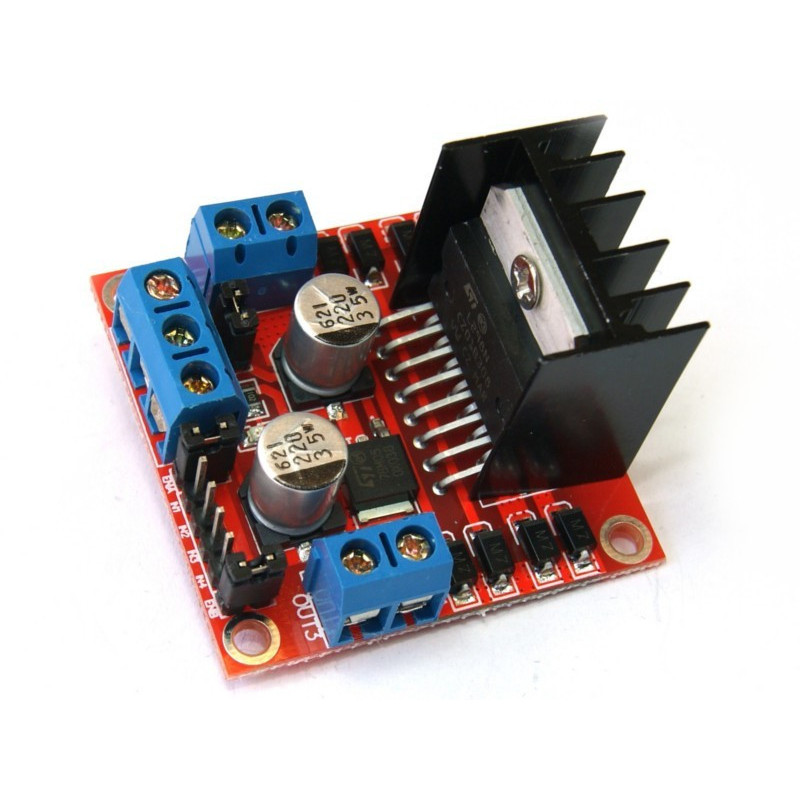
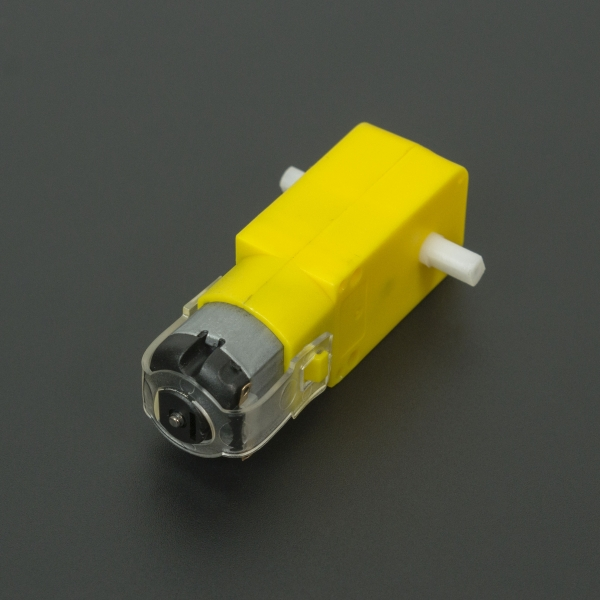
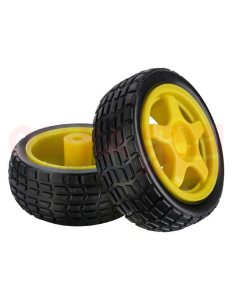
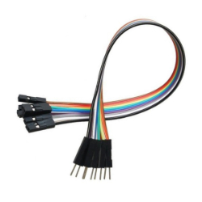
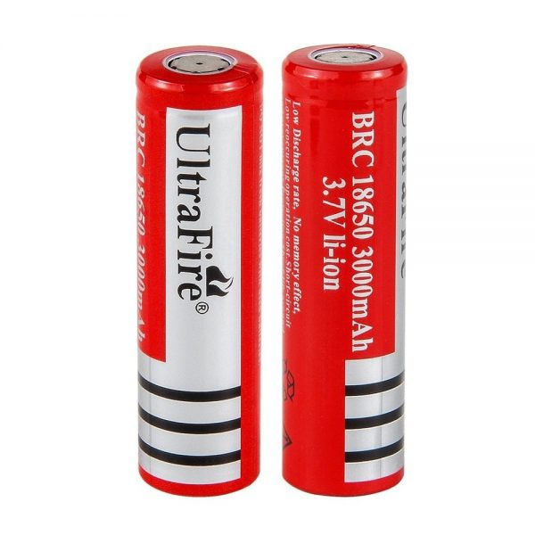

# Robot Car

Un carrito a control remoto es un vehículo pequeño, generalmente de juguete o en algunos casos utilizado en competiciones de hobby, que puede ser controlado a distancia mediante un dispositivo electrónico, como un control remoto. Estos carritos suelen tener motores eléctricos o a veces de combustión interna, y están equipados con sistemas de dirección y tracción que permiten su movimiento en diferentes direcciones, como adelante, atrás, izquierda y derecha.

## Para qué sirve

Un carrito a control remoto puede servir como una herramienta didáctica para estudiar varios conceptos y principios físicos. Aquí hay algunas aplicaciones:

### Cinemática

Se puede utilizar para estudiar el movimiento rectilíneo uniforme (MRU) o el movimiento rectilíneo uniformemente acelerado (MRUA). Midiendo el tiempo y la distancia recorrida en diferentes condiciones, se pueden analizar las relaciones entre la velocidad, el tiempo y la aceleración.

### Dinámica

Al observar cómo el carrito responde a diferentes fuerzas, como la fricción, la gravedad o las fuerzas aplicadas por un control remoto, se pueden explorar conceptos como la segunda ley de Newton (F = ma) y el concepto de fuerza neta.

### Trabajo y energía

Al estudiar cómo varía la energía cinética del carrito mientras se mueve bajo la influencia de fuerzas externas, se pueden aplicar conceptos de trabajo y energía cinética.

### Colisiones

Los carritos a control remoto se pueden utilizar para estudiar colisiones, tanto elásticas como inelásticas, y analizar la conservación del momentum y la energía en estas interacciones.

### Control y sistemas dinámicos

Desde un enfoque más técnico, el diseño y control de un carrito a control remoto implican aspectos de sistemas dinámicos, como el control de la velocidad, la dirección y la estabilidad del vehículo.

### Electromagnetismo

En la base de la mayoría de los motores eléctricos se encuentra el principio del electromagnetismo. Un motor eléctrico tiene al menos un imán permanente y una bobina de alambre enrollada alrededor de un núcleo de hierro. Cuando se aplica corriente eléctrica a la bobina, crea un campo magnético que interactúa con el campo magnético del imán, generando fuerzas que hacen girar el eje del motor.

### Ley de Ampère

Esta ley describe cómo la corriente eléctrica en un conductor crea un campo magnético alrededor del conductor. En el motor, cuando la corriente eléctrica pasa a través de la bobina, genera un campo magnético que interactúa con el campo magnético del imán permanente, produciendo un par de fuerzas que hacen girar el rotor del motor.

### Principio de la acción y reacción

Cuando el motor gira el eje, también ejerce una fuerza igual y opuesta sobre el cuerpo del motor, de acuerdo con la tercera ley de Newton. Esta fuerza es necesaria para mantener el equilibrio del sistema y evitar que el motor se desplace sin control.

### Transformación de energía

El motor convierte la energía eléctrica suministrada por la batería del vehículo en energía mecánica para hacer girar las ruedas. Este proceso implica la transformación de una forma de energía en otra, siguiendo los principios de conservación de la energía.

### Interacción de campos magnéticos

Cuando se activa el motor del carrito a través del control remoto, se genera un campo magnético alrededor de la bobina del motor. Este campo magnético interactúa con el campo magnético del imán permanente dentro del motor, creando fuerzas que hacen girar el eje del motor y, por lo tanto, impulsan el movimiento del carrito.

### Dirección del campo magnético

La dirección del campo magnético generado por el motor dependerá de la orientación de la bobina y el imán permanente. Al invertir la polaridad de la corriente eléctrica que pasa a través de la bobina, se puede cambiar la dirección del campo magnético y, por lo tanto, invertir la dirección del movimiento del carrito.

## Carrito Arduino

Un carrito a control remoto construido con Arduino es un proyecto popular en el ámbito de la electrónica y la robótica.

### Características

Características de nuestro carrito a control remoto basado en Arduino:

- **Plataforma base:** Esta construida con un chasis ligero y resistente, de metraquilato, el cual es lo suficientemente robusto para soportar los componentes y proporcionar estabilidad al vehículo.
  
- **Motores y ruedas:** Utiliza motores de corriente continua (DC) para impulsar las ruedas del carrito. Estos motores pueden ser controlados mediante PWM (modulación de ancho de pulso) para ajustar la velocidad y la dirección del movimiento.
  
- **Controlador de motor:** Se utiliza un controlador de motor compatible con Arduino, como un puente H, para controlar los motores de manera eficiente. Este controlador permite controlar la dirección y la velocidad de los motores.
  
- **Arduino:** Un microcontrolador Arduino actúa como el cerebro del sistema, procesando las señales del control remoto y enviando comandos al controlador de motor para controlar el movimiento del carrito.
  
- **Módulo de comunicación inalámbrica:** Se incorpora un módulo de comunicación inalámbrica, en nuestro caso, Bluetooth, para permitir el control remoto del carrito desde una distancia. Esto permite enviar comandos desde un control remoto.
  
- **Fuente de energía:** Se necesita una fuente de energía para alimentar tanto el Arduino como los motores. Utilizamos una batería recargable.
  
- **Sensores opcionales:** Implementamos un sensor de proximidad inductiva que solo puede detectar objetos metálicos.
  
- **Software:** Se desarrolla un software que se carga en el Arduino para interpretar las señales del control remoto, controlar los motores y manejar cualquier otro comportamiento deseado del carrito, utilizando el lenguaje de programación C/C++. Además, se desarrolló una aplicación para el manejo del carrito esto se realizó en APP INVENTOR.

## Implementos construcción del carrito a control remoto

- ESP32 Wroom 32 Esp-32 Wifi Bluetooth

- Puente H L298
 
 
- Motorreductor Amarillo Plastico 1 Kg*cm (5V)
  

- Llanta para motorreductor de 66Mm

  
-  Cables Jumpers MH
  
  
- Bateria Ultrafire 18650 6800mah Li-ion Recargable 18x67 Mm
  

- Porta Pila para 2 Baterias AA con Cable Conexion Serie
  
  
- Sensor Inductivo Sensor Proximidad Lj12a3-4-z/bx 6v-36v Npn

  

  
  
- Soldadura de estaño
 
- Metacrilato

## Implementos funcionamiento del carrito a control remoto

- Código Arduino
- App Inventor

## Funcionalidades

- Control remoto a través de Arduino.
- Movimiento bidireccional.
- Expansión con sensores (Sensor Inductivo de proximidad detector de metales).

## Código

Explicación del código.
